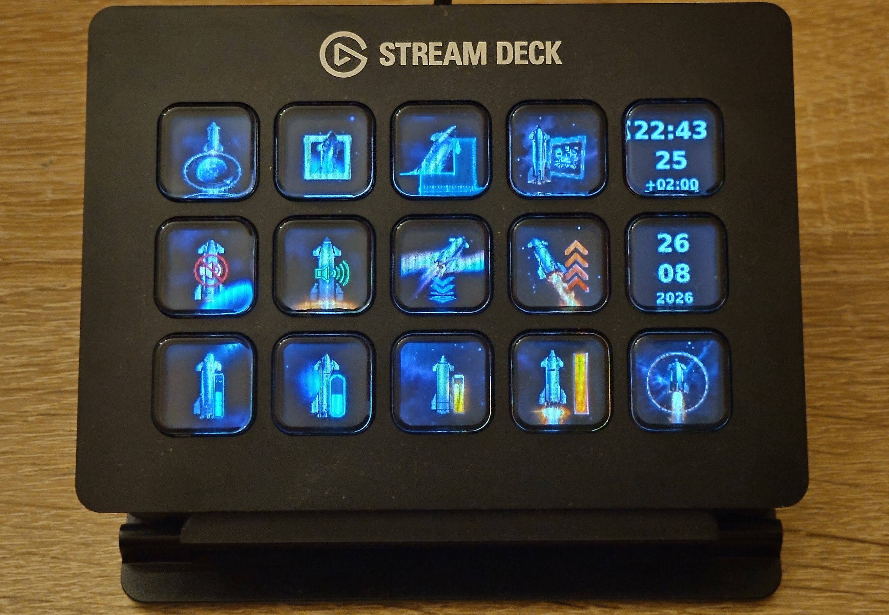

# Stream Deck Starship



Linux controller for the Elgato Stream Deck Original V2 (`0fd9:006d`) with
SpaceX Starship key art. It owns the device over HID and runs a fixed 5×3
layout: screenshots, volume, a live clock, and deck brightness.

## Features

- **Screenshots** — full desktop, active window, or region, saved under
  `~/Pictures`. A fourth key opens that folder in Thunar.
- **Audio** — mute, unmute, ±5%, and presets at 20 / 40 / 60 / 80 / 100%
  via WirePlumber `wpctl`.
- **Live clock** — time as `hh:mm` / seconds / timezone, date as day / month /
  year, kept visually matched.
- **Backlight** — press time to raise brightness 10%, date to lower it. Steps
  follow a measured Original V2 curve so they look even. 0% stays faintly on;
  100% stops before the hardware plateau that costs power for no extra light.
- **Follows the display** — when the monitor is in DPMS, the screensaver is
  active, or the session is locked, the deck goes to hardware 0% with black
  keys. It restores when the display comes back. A press on a sleeping deck
  wakes the session but does not run the key action.
- **Unplug safe** — waits for the device, reconnects, and repaints. Ctrl+C
  resets the deck and exits.

Only one process can own the HID device. Do not run a second instance (manual
or service) at the same time.

## Layout

```
Row 1: full shot | window shot | region shot | open Pictures | time / brightness +10%
Row 2: mute      | unmute      | vol −5%     | vol +5%       | date / brightness −10%
Row 3: vol 20%   | 40%         | 60%         | 80%           | 100%
```

Default backlight is 70% on that measured visual scale. Display sleep still
forces the deck fully off; the chosen level returns afterwards.

## Install

1. **Udev** (so the app does not need root). Unplug and replug the deck after:

   ```bash
   sudo cp udev/70-streamdeck.rules /etc/udev/rules.d/
   sudo udevadm control --reload-rules
   sudo udevadm trigger
   ```

2. **Build.** System package `libhidapi-hidraw0` is required.

   ```bash
   cargo build --release
   ```

3. **Screenshot helpers** into `/usr/local/bin`:

   ```bash
   ./scripts/install-screenshot-helpers.sh
   ```

4. **User service** (optional) so it starts after login:

   ```bash
   ./scripts/install-user-service.sh
   ```

   ```bash
   systemctl --user status streamdeck-starship.service
   journalctl --user -u streamdeck-starship.service -f
   systemctl --user restart streamdeck-starship.service
   ```

   After code changes: `cargo build --release` then restart the service.

## Run

Without the service:

```bash
cargo run --release
```

Screenshots need a graphical session (`DISPLAY` or `WAYLAND_DISPLAY`). If you
start the controller outside the desktop, it copies those variables from
`xfce4-session` (or another session process) via `/proc`.
